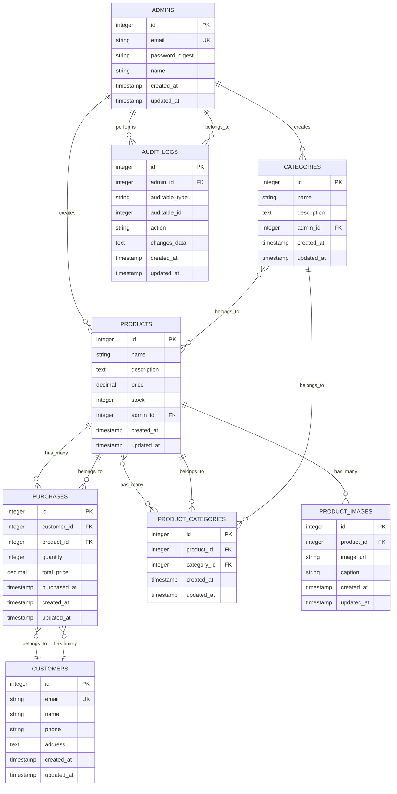

# Diagrama de Entidad-Relación - PuntosPoint E-commerce

## Diagrama Mermaid

## Descripción de las Entidades

### **ADMINS** (Administradores)
- **Propósito**: Usuarios administradores del sistema
- **Relaciones**: 
  - Crea categorías (1:N)
  - Crea productos (1:N)
  - Realiza auditorías (1:N)

### **CATEGORIES** (Categorías)
- **Propósito**: Clasificación de productos
- **Relaciones**:
  - Pertenece a un administrador (N:1)
  - Tiene muchos productos (N:N a través de product_categories)

### **PRODUCTS** (Productos)
- **Propósito**: Productos del e-commerce
- **Relaciones**:
  - Pertenece a un administrador (N:1)
  - Tiene muchas categorías (N:N a través de product_categories)
  - Tiene muchas imágenes (1:N)
  - Tiene muchas compras (1:N)

### **CUSTOMERS** (Clientes)
- **Propósito**: Clientes que realizan compras
- **Relaciones**:
  - Tiene muchas compras (1:N)

### **PURCHASES** (Compras)
- **Propósito**: Registro de compras realizadas
- **Relaciones**:
  - Pertenece a un cliente (N:1)
  - Pertenece a un producto (N:1)

### **PRODUCT_CATEGORIES** (Tabla de unión)
- **Propósito**: Relación muchos a muchos entre productos y categorías
- **Relaciones**:
  - Pertenece a un producto (N:1)
  - Pertenece a una categoría (N:1)

### **PRODUCT_IMAGES** (Imágenes de productos)
- **Propósito**: Imágenes asociadas a productos
- **Relaciones**:
  - Pertenece a un producto (N:1)

### **AUDIT_LOGS** (Logs de auditoría)
- **Propósito**: Registro de cambios realizados por administradores
- **Relaciones**:
  - Pertenece a un administrador (N:1)
  - Asociación polimórfica con entidades auditables

## Índices de Base de Datos

### **Índices Principales**
- `admins.email` (UNIQUE)
- `customers.email` (UNIQUE)
- `purchases.purchased_at`
- `purchases.customer_id, purchased_at`
- `purchases.product_id, purchased_at`
- `audit_logs.auditable_type, auditable_id`
- `product_categories.product_id, category_id` (UNIQUE)

### **Índices de Performance**
- `products.name`
- `products.created_at`
- `products.price`
- `categories.name`
- `audit_logs.created_at`
- `audit_logs.action`

## Características Especiales

### **Auditoría Automática**
- Todos los cambios en productos y categorías se registran automáticamente
- Uso de `ActiveSupport::CurrentAttributes` para tracking del admin actual
- Asociación polimórfica para flexibilidad

### **Validaciones**
- Emails únicos para admins y customers
- Stock suficiente para compras
- Precios y cantidades positivas
- Al menos una imagen por producto

### **Callbacks**
- Cálculo automático de precios totales
- Reducción automática de stock
- Envío de emails en primera compra
- Logging de auditoría 